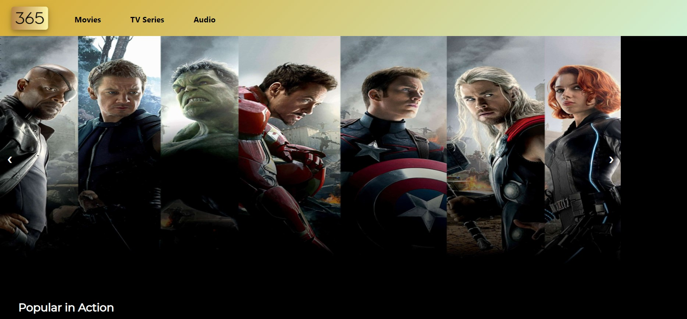
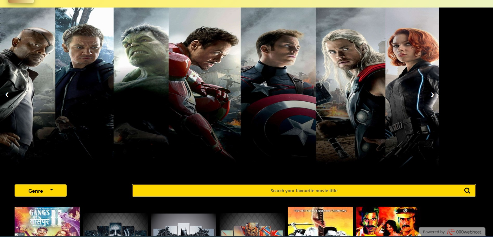
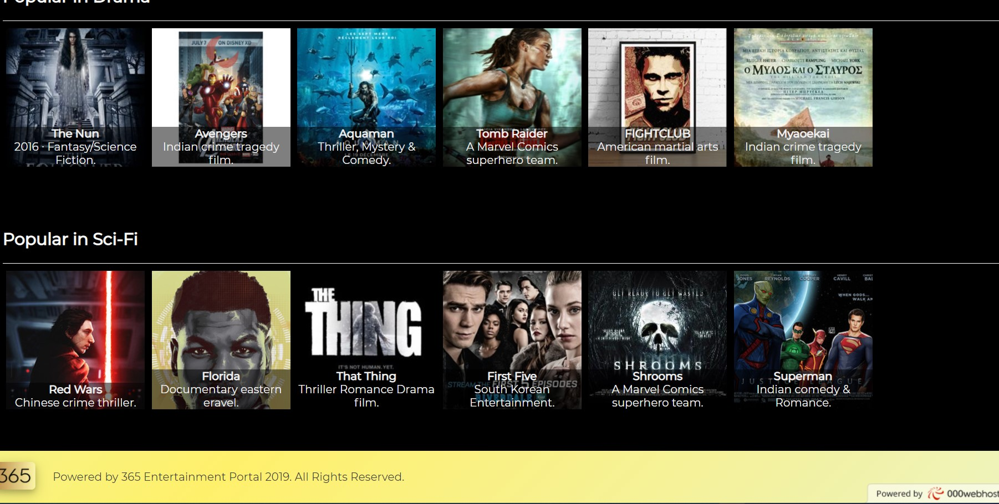
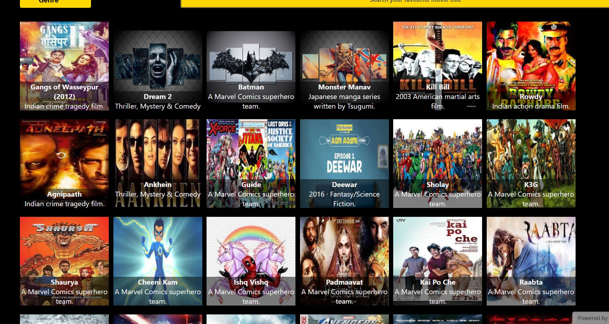

# Entertainment365

## The following descriptions below will give you a brief introduction about different sections of this web-page and how to design.

1. Website logo with box shadow and border radius css properties.
2. Header with navigation links 

3. Div Media carousal container NEXT button implement javascript onclick event. 
4. Media carousal container div containing Images to be displayed 
5. Sub div elements containing movie poster images and movie description as shown above. 
6.  tag element for Genre selection(All, Action, Drama, Sci-Fi).On select a particular option movies list gets filtered. 

7. Search text-box on entering required movie name filters data or outputs “no result found”. There’s a dummy search button and css font properties,border properties and background color have been applied.

8. Footer contains site logo and copyright info. If required, Action, Drama, Sci-Fi). other site-navigation links can also be merged.

